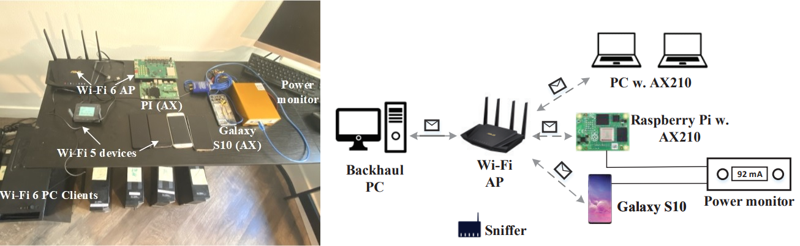

# A First Look at Wi-Fi 6 in Action: Throughput, Latency, Energy Efficiency, and Security


## Introduction 
The repository provides the data and codes for Wi-Fi 6 paper published in SIGMETRICS'23 paper ([Paper](https://dl.acm.org/doi/10.1145/3579451)).
The project is a comprehensive measurement study of various KPIs acheived by the first-generation Wi-Fi 6 (i.e., 802.11ax) network, including the OFDMA throughput, 
latency, and power consumption. The experiments is conducted with commodity Wi-Fi devices (e.g., RT-AX58U, Galaxy S10, and Intel AX210 depicted in the figure. We provide the raw data ([Example](https://github.com/liux4189/wifi-ax-measurement/tree/main/data) and [Full](https://www.dropbox.com/sh/b2fn1wkw3o962tj/AAAZbSBNwyqok_2hj9Uy6KRKa?dl=0))and examplary analysis [MATLAB code](https://github.com/liux4189/wifi-ax-measurement/tree/main/matlab). We also share the our developed linux scripts to facilitate multiple clients experiment [scripts](https://github.com/liux4189/wifi-ax-measurement/tree/main/code).



If you are interested in this work or have questions, please reach out to [Ruofeng Liu](https://liux4189.github.io/).

## Data
We collected three types of raw measurement data:
- .log: Throughput measurement log from ASUS router.
- .pcap: The wireshark capture using a Wi-Fi 6 sniffer.
- .csv:  The energy consumption trace of mobile devices captured by a power monitor.

### Name rules
The uplink and downlink files have slightly different naming rules. The downlink frame aggregation (AMPDU size) can be directly configured so the AMPDU configuration is specified in the file name. The name of downlink log follows:`{#USERS}{mu/su}_{#PC_NICS}pc_FA{#FRAME_AGGREGATED}_{BANDWITH}mhz_dl_mcs{MCS}_{PACKET_LENGTH}bytes.{log/pcap/csv}`. 
For example, 4su_4pc_FA3_dl_mcs3_4500bytes.log is captured in a downlink CSMA/CA test with 4 clients (all are PC users using AX210) and the 3 MPDUs aggregated to form a 4500-bytes AMPU.  In contrast, The uplink frame aggregation is indirectly configured using UL duration of OFDMA frame so the UL duration is specified in the file instead. The name of downlink log follows: `{#USERS}{mu/su}_{#USER}{DEVICE_NAME}_{BANDWITH}mhz_ul_mcs{MCS}_{UL_DURATION}us.{log/pcap/csv}`.  For example, 4mu_4pc_80MHz_ul_mcs9_800us.log is a throughput log with UL duration configured to 800us. 

| Paramter     | Description           | Value |
| ------------- |:-------------:| -----|
| #USERS    | The number of users in the test |  1-8 |
| mu/su     | OFDMA or CSMA/CA      |  mu:OFDMA is turned on; su:OFDMA is turned off. |
| {#USERS}{DEVICE_NAME} | The number of user with specific WiFi NIC    |  PC: Intel AX210, S10: Galaxy S10 |
|FA{#FRAME_AGGREGATED}| The number of MAC packet aggregated in AMPDU transmission |- |
|{BANDWITH}mhz| Bandwith setting | 20/40/80| 
|{PACKET_LENGTH}bytes| The aggregated packet length| -|
|{UL_DURATION}| Uplink duration of the OFDMA transmission| 0 - 4096, default value is 4096 if not specified  |


### Directory structure
```bash
├── throughput (the throughput .log files)
│   ├── baseline_FAoff_bandwidth (baseline single user benchmark with frame aggregation turned off)
│   ├── baseline_FAon_bandwidth (baseline single user benchmark with frame aggregation turned on)
│   ├── dlofdma (Downlink multiple user throughput)
|   |   ├── UDP\ofdma\FAx  (Downlink OFDMA throughput UDP test with AMPDU size = x)  
|   |   ├── TCP\ofdma\FAx  (Downlink OFDMA throughput TCP test with AMPDU size = x)
│   ├── ulofdma (Uplink multiple user benchark)
|   |   ├── UDP\ofdma\x  (Uplink OFDMA throughput UDP test, x is the trial id)  
├── pcap (The wireshark sniffer captures)
│   ├── dlofdma\FAx (Downlink multiple user pcap  with AMPDU size = x)
│   ├── ulofdma (Uplinklink multiple user pcap)
├── power (The power monitor real-time log)
│   ├── dlofdma (Downlink multiple user energy efficiency benchmark)
|   |   ├── csv  (The raw power monitor log) 
|   |   ├── log  (The throughput log in the corresponding experiment)  
│   ├── ulofdma (Uplink multiple user energy efficiency benchmark)
|   |   ├── csv  (The raw power monitor log) 
|   |   ├── log  (The throughput log in the corresponding experiment)
```

## MATLAB Script
```bash
├── throughput
│   ├── dl_throughput_baseline_singleuser.m (single user downlink throughput analysis)
│   ├── dl_throughput_ofdma.m (downlink ofdma throughput benchmark)
├── power 
│   ├── dlofdma_powerprofile_S10.m (Downlink power profile of Galaxy S10)
│   ├── ulofdma_powerprofile_S10.m (Uplink power profile of Galaxy S10)
├── utils (functions to parse router log files)
```
## BibTeX
```bash
@article{10.1145/3579451,
author = {Liu, Ruofeng and Choi, Nakjung},
title = {A First Look at Wi-Fi 6 in Action: Throughput, Latency, Energy Efficiency, and Security},
year = {2023},
issue_date = {March 2023},
publisher = {Association for Computing Machinery},
address = {New York, NY, USA},
volume = {7},
number = {1},
url = {https://doi.org/10.1145/3579451},
doi = {10.1145/3579451},
journal = {Proc. ACM Meas. Anal. Comput. Syst.},
month = {mar},
articleno = {25},
numpages = {25},
keywords = {TWT, IEEE 802.11ax, Wi-Fi 6, OFDMA}
}
```
