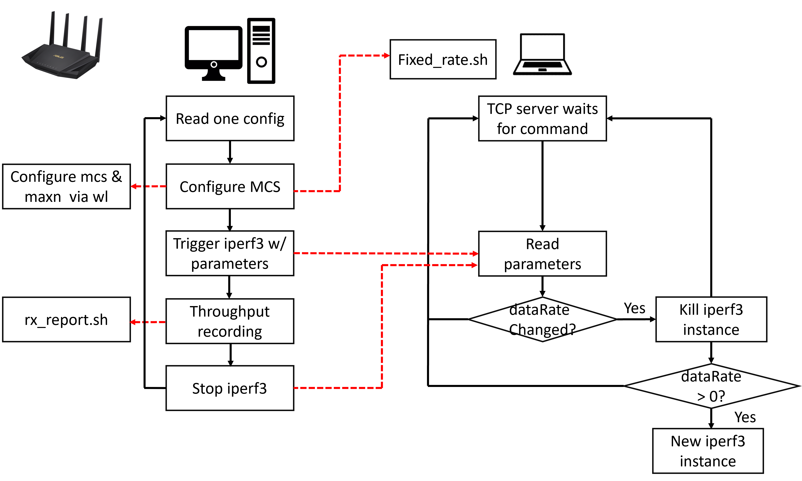

# Uplink Multi-STA Test
## Description


The codes in this repository are used for uplink iperf3 throughput measurement in a batch. The scheduler running on the desktop (192.168.50.101) can 1) configure the uplink MCS in both broadcom AP and AX200 clients; 2) configure iperf3 test paramtes on AX200 clients including the datarate and iperf3 server port); 3) trigger the iperf3 test by sending command to iperf3.c; 4) call wl command of AP to record the rx throughputs.
## Files
1. *scheduler.c*: the scheduler of the experiment runs on the server PC.
2. *config.csv*:  configuration of the tests. 
3. *setup.sh*:
4. *iperf3_daemon.c*
5. *fixed_rate.h*
6. *rx_report.sh*

## Dependency
ubuntu 20.04, kernel 5.11.0-27-generic
iperf3.9 

## Working flow


## Usage
1. Deploy the test scripts on the server and clients.
*  *Server*  ~/workspace/ul_autotest/ directory has scheduler.c, setup.sh, rx_report.sh, and config.csv  
*  *Client* ~/workspace/ul_autotest/ directory has iperf3_daemon.c, fixed_rate.sh

2. Compile C programs.
   At the server, run
   ```gcc -o scheduler scheduler.c -lm```
   At the client run
   ```gcc -o iperf3_daemon iperf3_daemon.c```
   
3. Run setup.sh on the server. The AP and all devices under test will be configured properly (including setup ssh key for passwordless acess and copy rx_report.sh script to AP). Note that depend on the devices to test, we might need to modify the variable IParray before running setup.sh. 

4. Edit the config.csv. Each row of config.csv specify the seting of one test.

*  addrPrefix. The subnet prefix of the Wi-Fi network.
*  cPort. The tcp port that the client program (iperf3_daemon.c) listen to for receiving control command from the scheduler. 
*  server. The suffix of the IP address of the server. 
*  clients. The list of suffix of the IP address of the clients, separated by "/"
*  sPorts.  The list of ports that iperf3 servers use. 
*  fixed_rate. Used to configure the MCS of clients. It is the input argument of fixed_rate.h
*  ul_ofdma_mcs. Used to configure the uplink ofdma MCS at the AP.
*  dataRate(mbps). Used to configure the iperf3 data rate.
*  devname.  The description of the client device in the test. This is only used to generate the name of Log files.
*  ofdma.  0: CSMA/CA 1:OFDMA. This is only used to generate the name of Log files.
*  duration(s). The duration of the test
